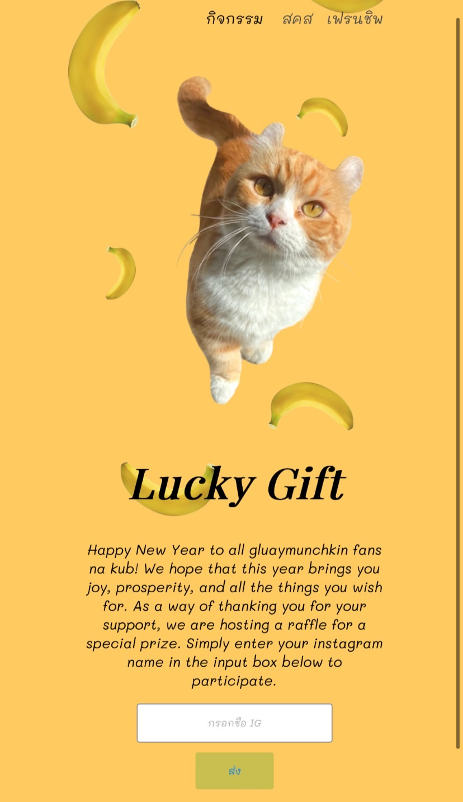
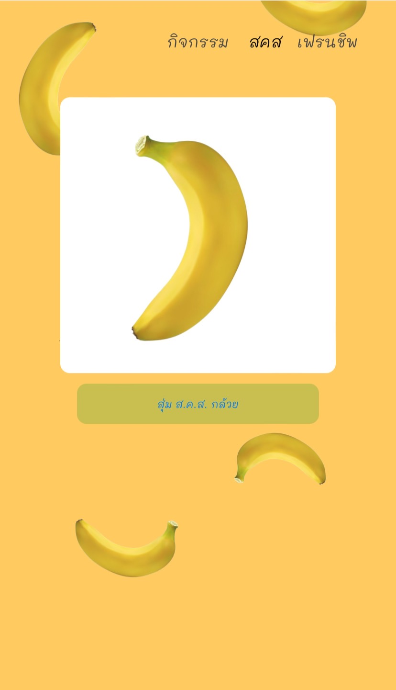

# gluaymunchkin_newyear_webservice
This repository contains the code for a website celebrating the New Year festival for the beloved "Gluaymunchkin" cat. The website is built using Node.js and the EJS engine, offering a dynamic and interactive platform to showcase the festivities. 

to run the service you will need to install all of the package include in package.json
```
npm install
```

After install all the package needed, you will need to create new SQL Database and change the credentials of the DB in app.js,
(he current DB does not work anymore since I didn't manage to extend the session of it)
```
var connection = mysql.createConnection({
    host: "localhost",
    user: "Username",
    password: "Password",
    database: "Database Name"
});
```


To run the website type :

```
npm start
```
or 
```
node app.js
```

Images of the Website (It was designed to be used in Instagram browser)

or

https://pkbsa.github.io/gluaymunchkin_newyearraffle/index.html

   
